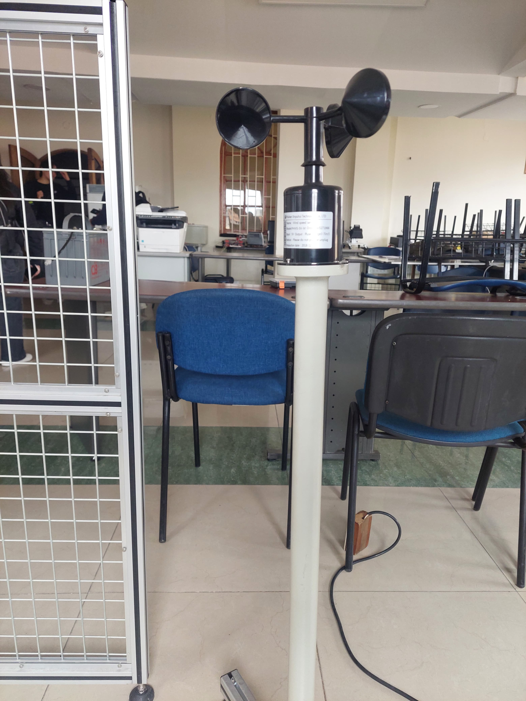
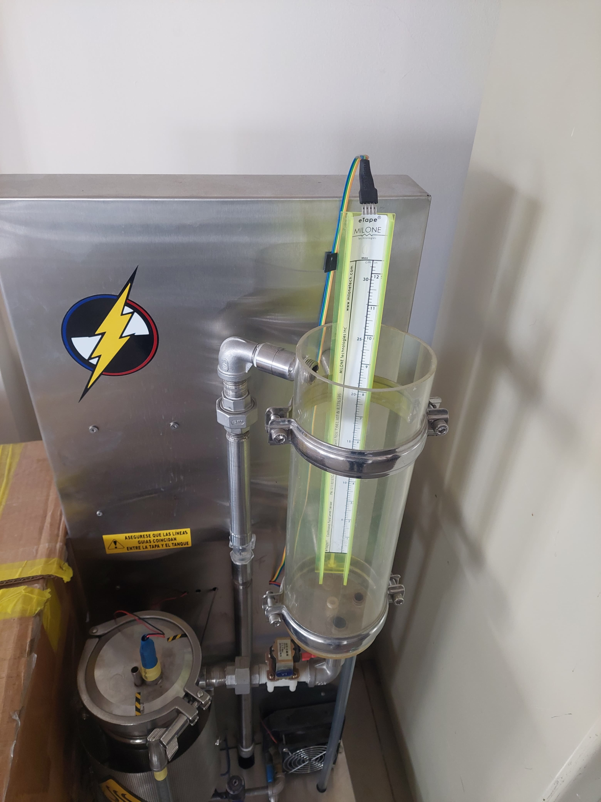
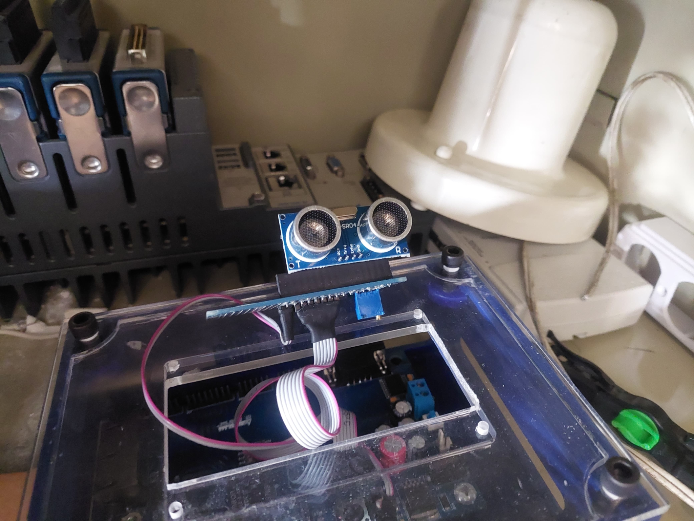
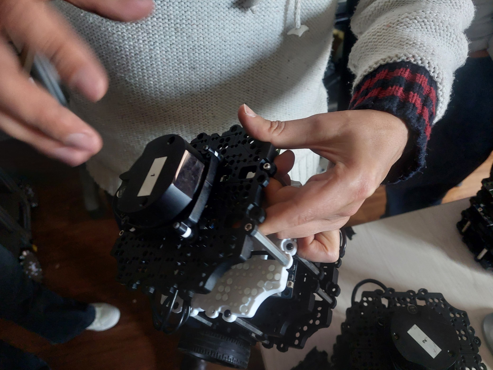

# 📡 Sensores - Comunicaciones Industriales

Este repositorio documenta diferentes sensores utilizados en el laboratorio de la Universidad Santo Tomas en Bogota, como parte del curso de **Comunicaciones Industriales**.  
Cada sensor incluye su descripción, principio de funcionamiento, aplicaciones y fotografía tomada en el laboratorio.

---

## 1️⃣ Sensor térmico en cabina

**Descripción:** Sensor de temperatura integrado en una cabina metálica para mediciones de control ambiental.  
**Principio de funcionamiento:** Utiliza termistores o RTDs para medir la temperatura interna, transmitiendo la señal a un controlador.  
**Aplicaciones:** Control de temperatura en procesos industriales, incubadoras, hornos o cámaras de pruebas.

---

## 2️⃣ Anemómetro (sensor de velocidad del viento)

**Descripción:** Dispositivo con cazoletas que mide la velocidad del viento.  
**Principio de funcionamiento:** La rotación de las cazoletas se convierte en una señal eléctrica proporcional a la velocidad.  
**Aplicaciones:** Meteorología, sistemas de ventilación y estaciones climáticas.

---

## 3️⃣ Sensor de nivel (tipo resistivo)

**Descripción:** Sensor que mide el nivel de líquido en un recipiente mediante una varilla graduada.  
**Principio de funcionamiento:** Detecta cambios en resistencia o capacitancia según el nivel de fluido.  
**Aplicaciones:** Control de tanques, procesos industriales y sistemas de bombeo.

---

## 4️⃣ Sensor ultrasónico

**Descripción:** Módulo ultrasónico que mide distancias emitiendo pulsos de alta frecuencia y calculando el tiempo de retorno.  
**Principio de funcionamiento:** Efecto del tiempo de vuelo (ToF) de ondas ultrasónicas.  
**Aplicaciones:** Medición de distancia, detección de obstáculos y robótica.

---

## 5️⃣ Sensor LiDAR

**Descripción:** Sensor óptico que utiliza láser para medir distancias y generar mapas 3D del entorno.  
**Principio de funcionamiento:** Emisión de pulsos láser y cálculo del tiempo de retorno para determinar distancias.  
**Aplicaciones:** Vehículos autónomos, mapeo 3D, robótica y sistemas de navegación.

---

## 📚 Referencias
- Laboratorio de Robotica Universidad Santo Tomas  
- Laboratorio de Energias Universidad Santo Tomas
- Notas de clase  

> 📌 **Nota:** Este material es de uso académico y corresponde al registro fotográfico y técnico de los equipos disponibles en los laboratorio.
